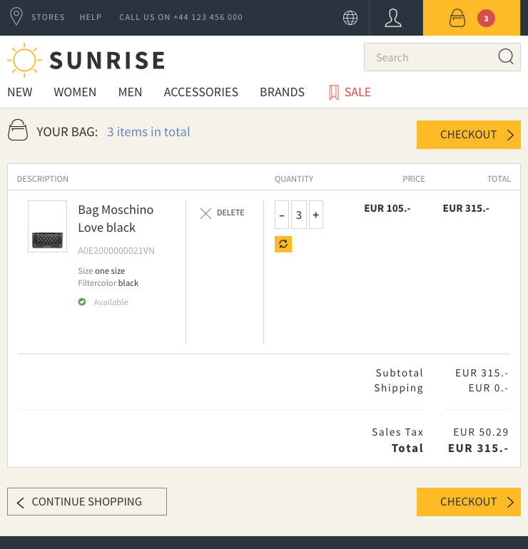
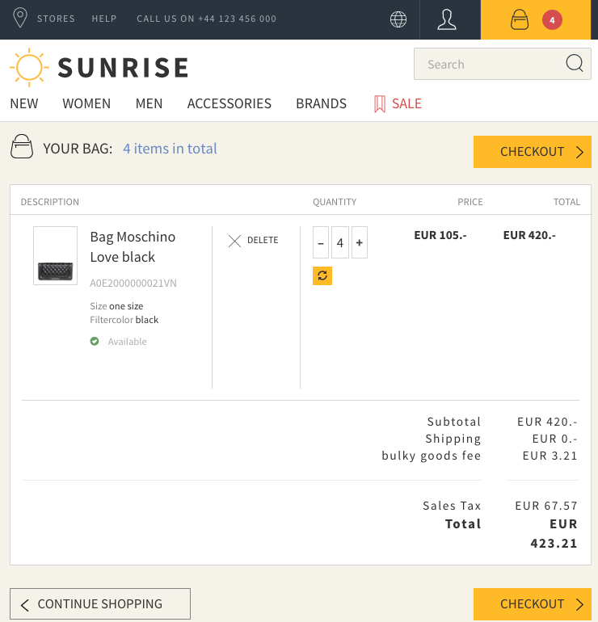

The learning goal is to add hooks to the cart updates to include extra fees or discounts which can only expressed in the shop application.

In this example an imaginary fee has to be added to the cart if the total count of line items is greater than 3. Normally this would be based on product attributes with a flag or an actual sum of the weight of the items but for simplicity we use the line item count.

Normally with 3 line items or less, no extra fee is applied:

But adding a fourth item will add the fee:

The [template](../../conf/templates/components/LastViewedProducts/productsView.hbs) is already implemented.

The component is already registered for the non-checkout controllers in [Module.java](../../app/Module.java).

Still missing is the implementation of the 3 hooks and getting the required helper objects via dependency injection in [LastViewedProductsComponent](LastViewedProductsComponent.java).

The first hook is specifically called when a product variant (not just a product!) is loaded and stores the SKU in the session.

The second hook is called on every request and triggers to load the products from the commercetools platform belonging to the SKUs in the session.

The third hook is called for the page data and adds the ComponentBean to the PageContent which is part of the PageData.
